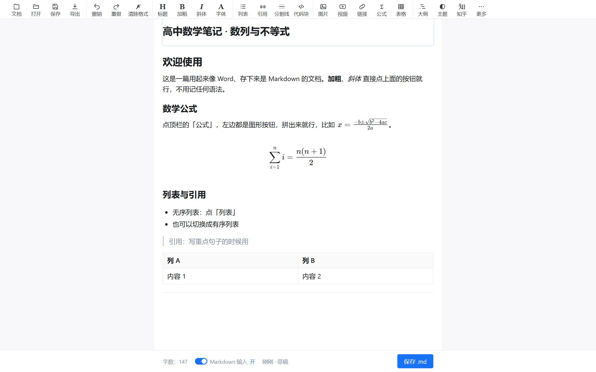
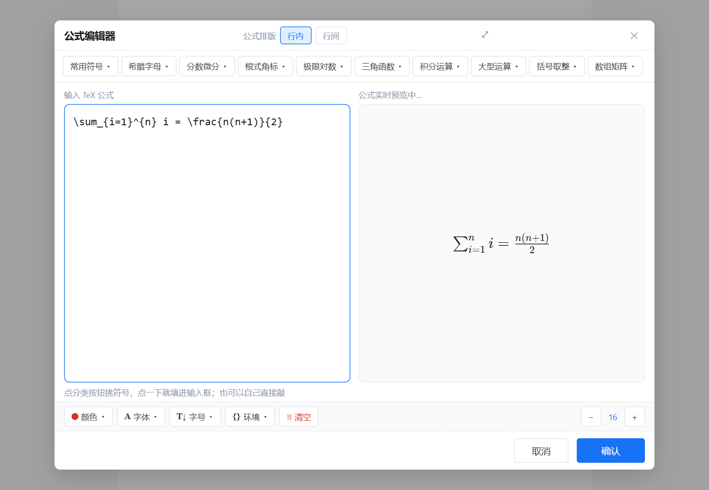
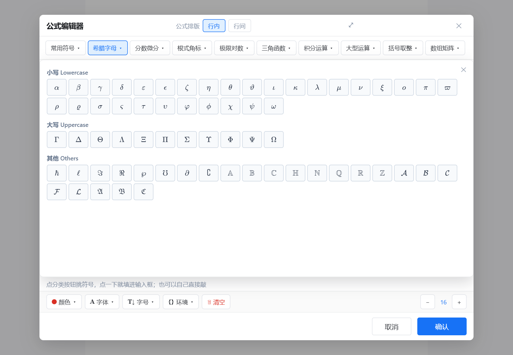

# Dadealbit Markdown 编辑器

**打开就能写、不用懂语法的数学笔记编辑器。** 默认所见即所得，公式全靠点按钮拼出来，
存下来却是标准 `.md` 文件；整个程序就是**一个 HTML 文件**，双击即用，不装东西、不联网。

> 为「想记数学笔记但不想学 Markdown 语法」的人做的：像用 Word 一样写，像用 Markdown 一样存。



---

## 为什么做这个

市面上写公式的编辑器大致两种：要么得记 LaTeX / Markdown 语法（对高中生不友好），
要么是网页服务（要联网、要登录、笔记不在自己手里）。

这个编辑器的目标很具体：**点按钮就能写出干净的数学笔记，文件永远在自己电脑上。**

- 打开一个 HTML 文件就能写，不需要安装、不需要服务器、不需要网络
- 公式用分类符号面板拼，也可以敲 LaTeX（有自动补全）
- 存的是标准 `.md`，纯文本、能被任何编辑器打开、也不会被某个软件锁死
- 所有内容存在本机浏览器里，关掉再打开还在

## 功能

**公式（重点）**

- 公式弹窗里有 **10 个分类**：常用符号 / 希腊字母 / 分数微分 / 根式角标 / 极限对数 /
  三角函数 / 积分运算 / 大型运算 / 括号取整 / 数组矩阵
- 共收录 **386 个符号**，每个都带中文名和 TeX 命令，点一下就填进输入框
- 也支持直接敲 TeX：`\sum_{i=1}^{n}` 这类，边敲边补全（**最多 3 条候选**，
  带图形＋命令名＋中文名，↑↓ 选择、回车插入）
- 右侧**实时预览**；括号不配对、分母为空这类小错会给温和提示，不报错不崩溃
- 正文里的公式是一个积木块，点一下就能重新编辑



**排版与外观**

- 标题 / 加粗 / 斜体 / 列表 / 引用 / 分割线 / 代码块 / 表格 / 链接 / 图片 / 视频，都是点按钮
- **插入视频**：粘贴 B 站（BV/av 号、播放器地址、手机分享文案都认）或 YouTube（`watch`、`youtu.be`、
  Shorts、直播回放都认）链接，正文里嵌成播放器；手机 App 分享的 `b23.tv` 短链会提示你去复制带 BV 号的完整链接
- **代码块能选语言**：右上角点一下，**33 种主流语言按字母顺序**排好（Python / JavaScript / C++ / SQL…），
  选哪种就按哪种的语法上色；也可以选「自动识别」让它自己判断，或选「Plain text」保持黑白。
  别人的 `.md` 里写 `js` / `py` / `yml` 这种简写也认；选了之后**导出、存草稿箱都带着语言标记**
- 正文**字号、字体、文字颜色**可以调（颜色作用于选中的文字）
- **可以自己装字体**：选一个 `.ttf` / `.otf` 文件，装好即用、可删除
- **浅色 / 深色主题**，也可以跟随系统
- 界面按知乎写文章页实测的配色与尺寸做的，读起来是熟悉的感觉

**实用功能**

- **多篇文档**：工具栏最左边的「文档」里新建 / 切换 / 删除
- **搜索定位**：工具栏「搜索」或 **Ctrl+F** —— 输入就出结果（`第几条/共几条`），
  命中处黄底高亮、当前那条深底，**下面还会列出每一处命中的原文**（带前后文、关键词高亮），
  点哪一条就跳到哪一条。回车 / Shift+回车在命中之间跳，Esc 关掉。
  用的是编辑器自己的文档模型，所以**公式、代码块里的字也能搜到**；
  高亮只是显示层的东西，**不会改动文档、也不会写进导出的文件**
- **用了多久 / 现在几点**：左下角状态栏有「用时：X 分钟」（关掉再开也接着累计），
  旁边是一枚每秒走的时钟，写东西时不用切出去看时间
- **使用反馈**：「更多 → 使用反馈（发邮件给作者）」—— 里面已经把
  **当前文档字数 / 本次用时 / 累计用时** 填好了，点一下用邮件发出（也可以复制）。
  只带这几个数字，**不会带上你的文档内容**
- **快捷键可自定义**：29 个动作随便改键
- **保存 / 导出**（工具栏「保存」一个按钮，点开选格式）——前三种是"图片一定显示得出来"的格式：
  - 知乎用 `.md`：**发知乎就用它** —— 公式换成知乎认的写法，本机图片自动上传换成公开网址
  - HTML 网页（离线可看，图片也在网页里） / PDF（打印对话框另存为）
  - 拿不到公开网址时（助手没开、也没填图床令牌）**文件照给**，只是那几张图上面会多一行提示，
    说清"这几张要手动补"，并告诉你可以先开助手或填图床令牌重新导一次
  - 最后一项「存一份自己看的 `.md`」：图片内嵌的纯 Markdown 存档（自己看 / 备份用；
    **不要**拿去知乎导入 —— 那种文件知乎读不到内嵌图片）
- **自动保存**：不用管保存按钮，关掉浏览器再打开内容还在

<!-- 自用专属：开始（这段只在本地「自用」分支上，公开分支没有；下面的检查脚本会按标记核对） -->
- **🖱️ 鼠标点击特效**（**只有自用分支有**）：点一下屏幕会荡开一圈波纹，可以在「特效」按钮里
  调档位（只显波纹 / 波纹 + 粒子 / 全开）、缩放、拖尾刷新率、透明度，以及 6 套配色
  —— 纯净版构建里**连特效代码都不会进产物**（用 Vite alias 换成空壳 + 构建期常量摘掉按钮）
<!-- 自用专属：结束 -->



## 快速开始

**只要编辑器（推荐）**：下载 [最新 Release](https://github.com/Dadeal167/Dadeal.bit-Markdown-Editor/releases/latest) 里的
`Dadealbit-Markdown-Editor-v1.0.0.html`，或者仓库根目录里那个同名的 `Dadealbit Markdown 编辑器.html`，**双击打开**即可。

没看错，就一个文件 —— 约 2.8 MB，JS / CSS / 数学字体全部内联在里面。
可以拷到 U 盘、发给同学，对方双击就能用（不需要装 Node、不需要联网）。

**还想要「一键存到知乎草稿箱」**：下载 Release 里的
`Dadealbit-Zhihu-Assistant-v1.0.0.zip`（约 37 MB），**解压后双击里面的「开始使用.bat」** ——
它会在后台悄悄起助手、自动带上令牌、并打开编辑器。**包里自带便携版 Node，不用自己装任何东西。**

**方式三（给改代码的人）**：从源码构建：

```bash
pnpm install
pnpm build          # 生成对外发布的那份 HTML
```

> 仓库根目录只有一个 HTML 和几个文件夹，`.bat` 都收在 **`启动器\`** 文件夹里
> （`开发模式.bat` / `重新构建.bat` / `启动知乎助手.bat`），是**给 clone 了仓库、装了 Node 依赖的人**用的；
> 只是下载编辑器来用的同学**不用管它们**，直接双击上面那个 HTML 就行。

## 传到知乎

> **想省事就往下看「存到草稿箱」那节**：点一下，十几秒，正文 / 公式 / 图片（含本机图片）全都过去，
> 图片由知乎自己托管，**不需要图床、不需要在知乎里手动操作**。
> 下面这条「导出 .md 再导入」适合另一种需求：你要的是一份**能带走、能给别的平台用**的 .md 文件。

### 导出 .md，用知乎自带的「导入」（文件带走 / 换平台用）

1. 编辑器里点工具栏最右边的「**知乎**」→ 点「**导出知乎 .md**」
2. 打开知乎 → 写文章 → 编辑器右上角「**导入**」→ 菜单里选「**导入文档**」→ 选刚下载的文件
3. 标题单独填一下（面板里有「复制标题」一键复制）

**为什么要用这个导出而不是直接保存 .md**：知乎的 Markdown 导入**不认 `$…$` 公式**。
这个导出会把每个公式换成知乎自己的公式标记
（``），
导入后是**可再编辑的真公式**，不是图片。标题层级、加粗、列表、引用、代码块、表格都照常带过去
（表格实测能过；实测见 `.probe` 里的导入脚本）。

> 图片：知乎导入只认**图片网址**，所以导出时会把本机图片先传到图床换成公开网址
> （助手在就自动传，没开助手就在「图床设置」里填一次 GitHub 令牌）。
> 拿不到网址时**文件照样给**，但那几张图上面会各加一行 `> 🖼️` 提示，导入后需要手动补。
> 嫌麻烦就直接用「存到草稿箱」——那条路不用图床。
> 另外：太小的图（几百字节那种测试图）知乎抓图会判「上传失败」，正常截图 / 照片没这个问题。

### 推荐：让本机助手直接存进草稿箱（不用图床、不用手动导入）

写好的笔记也可以一键送进知乎的**草稿箱**，在知乎里接着改，确认没问题再自己发布。

1. 双击 `开始使用.bat`（在 [Release](https://github.com/Dadeal167/Dadeal.bit-Markdown-Editor/releases/latest)
   下载的 `Dadealbit-Zhihu-Assistant-v1.0.0.zip` 里，解压后就能看到）。它会在后台悄悄启动助手（**不弹黑窗口**）、
   等它就绪，然后自动打开编辑器，并顺手把令牌带过去
2. 编辑器里点「**知乎**」，看到「✅ 助手已连接」就行
3. 心里没底就点「**检查一下能不能用（自检）**」：助手会另开一篇临时草稿
   （标题「Dadealbit 自检（可删）」）把**正文 / 公式 / 图片 / 表格**各真跑一遍，十几秒给结论。
   知乎改版导致过"看着存进去了、刷新后是空的"这种事，这个按钮就是用来当场发现的
4. 点「存到草稿箱」，等它跑完（正文和公式**十几秒**就交完；**图片是一张张真粘贴进去的**，
   每张约 5–10 秒，八张图大概一两分钟）。跑完面板会报「公式 N 个 · 图片 N/N 张」，
   数字对不上就别急着用，先去草稿箱看一眼

> 有图片时：助手会**弹出一个浏览器窗口**，并且在推送期间**占用你的剪贴板**（每张图写一次，推完就还给你）。
> 这是没办法的办法——知乎那条"图片导入"通道会静默吞图（草稿里显示「图片导入失败」），
> 所以图片只能像你手工复制粘贴那样送进去；位置由正文里的标记保证，图不会跑到文末。

用完想彻底关掉：双击 `停止助手.bat`（顺手关掉助手专用的那个浏览器窗口）。

`Dadealbit-Zhihu-Assistant-v1.0.0.zip` 里带了便携版 Node（`runtime\node.exe`），所以**不用装 Node.js**。
万一开始使用.bat 报错，旁边还有 `启动知乎助手.bat` 那条老路（会留窗口，方便看原因），
手动粘令牌也一样能用。**clone 仓库自己跑**的话：先 `pnpm install`，再双击 `启动器\启动知乎助手.bat`。

几点说明：

- **只存草稿，不会发布** —— 代码里没有任何点「发布」的路径，发布由你自己在知乎点
- 存到草稿箱时，助手会**先按标题找你已有的同名草稿**：找到就更新那一篇（会把里面清干净再写），
  找不到才新建 —— 所以同一篇文档反复上传，草稿箱里始终只有一篇，不会越堆越多
  （面板上会写明这次是「已更新同名草稿」还是「新建」）
- 这是**非官方能力**（驱动网页操作，不是官方 API）：知乎改版可能需要更新助手
- 助手只监听本机 `127.0.0.1` 并需要令牌；登录信息存在 `~/.dadealbit/`，不碰你日常浏览器
- 启动器把令牌放在地址栏 hash 里传给编辑器，编辑器读完立刻用 `replaceState` 抹掉
  （不留在历史记录里），令牌只存进本机浏览器的 localStorage

## 快捷键

| 动作 | 默认键 | 动作 | 默认键 |
|---|---|---|---|
| 保存 | `Ctrl+S` | 加粗 | `Ctrl+B` |
| 打开 | `Ctrl+O` | 斜体 | `Ctrl+I` |
| 撤销 / 重做 | `Ctrl+Z` / `Ctrl+Y` | 插入链接 | `Ctrl+K` |
| 标题 1/2/3 | `Ctrl+1/2/3` | 插入图片 | `Ctrl+Shift+P` |
| 无序 / 有序列表 | `Ctrl+Shift+8` / `Ctrl+Shift+7` | 全屏 | `F11` |
| 搜索 | `Ctrl+F` | 搜索的下一条 | `回车` / `Shift+回车` |

全部 29 个动作都能在「更多 → 自定义快捷键」里改键，帮助面板里的键位会跟着变。

## 常见问题

**我的笔记存在哪？会不会丢？**
存在这台电脑的浏览器里（localStorage + IndexedDB，后者用于存放你安装的字体）。
关掉浏览器、重启电脑都还在。但**清空浏览器数据会一起清掉**，所以重要的东西建议定期
「保存 .md」留一份文件。

**为什么「双击打开」和「开发服务器」里的笔记互相看不见？**
浏览器按来源隔离数据：`file://` 打开的和 `http://127.0.0.1:5173` 打开的是两套存储。
要搬内容就用「保存 .md」→ 另一边「打开」。

**提示"改动没能保存"？**
文档现在存在 **IndexedDB**（额度按磁盘剩余空间算，图片多也不会像以前那样几篇就写满），
所以这条提示基本只会出现在"浏览器被设成不保存数据 / 隐私模式 / 磁盘真的满了"这种情况。
碰到就先「保存 .md」把这篇导出到文件，再排查浏览器设置。

**导入的 .md 里图片是裂的？**
不少导出工具（知乎导出、"网页转 Markdown"工具等）会把图片存成旁边的
`assets/xxx.jpg`，正文里写相对路径。编辑器是一个单独打开的本地网页，浏览器出于
安全限制**不允许它去读旁边的文件夹**，所以这些图一定是裂的。

导入后编辑器会自己浮出一条提示，点「选导出文件夹修复」选中那个装着 `assets`
的目录即可——图片会按文件名自动配对、压缩后嵌进文档（关掉再打开还在）。
也可以随时用「更多 → 检查图片与公式」重新体检。

**公式变成红框 / 显示不出内容？**
大多不是编辑器的问题，而是源文件里的写法坏了：导出工具常把公式里的反斜杠
多写一层或少写一层（`\left \\{ x \right \\}`、结尾多个 `\`、`\or` 这类不存在的命令）。
导入时会**自动修好**能修的，修不了的那个公式会套一个红框并提示"写法有问题，点击修改"，
点一下就能手动改。旧文档可以点提示条上的「一键修复公式」批量修。

**从网页复制粘贴过来的公式为什么是乱的？**
很多导出工具（知乎导出、网页转 Markdown 工具）生成的 HTML 里，公式**本来就是纯文本
`$…$`**；粘贴这条路以前不认公式，于是原样留在正文里变成一行反斜杠。现在三条路都处理了：
- 粘贴 Markdown 文本：和「打开」一样先保护公式，`$a_1$` 不会被 Markdown 吃成斜体
- 从网页粘贴：粘完自动把正文里的 `$…$` 原文转成真正的公式
- 已经粘坏了的旧文档：提示条上会出现「转成公式」，点一下批量转好

只有内容看着确实像公式的才会转，所以"原价 $100，现价 $60"这种正文不会被误伤。

**表格能传到知乎吗？**
暂时不能（知乎的表格交互没摸透），可以在知乎里手工补一下。

**深色主题打印出来是黑底吗？**
不会，打印 / 导出 PDF 时会强制回到浅色。

## 技术栈

- [TipTap 3](https://tiptap.dev)（ProseMirror）+ React 19 + TypeScript
- [KaTeX](https://katex.org) 渲染公式
- Vite 打包；交付时把所有资源内联成**单个 HTML**（`file://` 下浏览器会拦截外部
  module 脚本和样式表，所以必须内联）
- 界面数据按知乎写文章页实测的配色与尺寸复刻

## 开发

```bash
pnpm dev            # 开发服务器 http://127.0.0.1:5173
pnpm build          # 生成可直接双击的单文件 HTML（同时更新 dist）
pnpm pack:folders   # 打出交付文件夹
```

<!-- 自用专属：开始 -->
> **自用分支的构建命令不一样**（因为要出两个版本）：
>
> ```bash
> pnpm build:pure     # 纯净版 → Dadealbit Markdown 编辑器.html（对外那份，会进仓库）
> pnpm build          # 完整版 → Dadealbit Markdown 编辑器-特效版.html（带特效，不进仓库）
> pnpm build:both     # 两个都出
> ```
>
> 这条分支上的自动化检查多两套，专门守"两版只差特效"这件事：
>
> ```bash
> pnpm check:parity-source   # 源码层：两分支的差异文件必须在白名单里、公共文件的改动必须整块与特效有关
> pnpm check:parity-builds   # 产物层：两个 HTML 跑同一套动作，指纹逐项对比（只允许差一个「特效」按钮）
> ```
<!-- 自用专属：结束 -->

这个项目比较看重的两点：

1. **改动都要有验证**——仓库里有十几套自动化验证（共约 300 项断言），
   从核心交互、逐按钮点击、公式符号逐个渲染，到"关掉浏览器再打开数据还在"，都能一键跑：

   ```bash
   pnpm check:all          # 一把跑完全部（自己起 dev server + 出汇总表）
   pnpm probe              # 核心交互 75 项
   pnpm audit:buttons      # 逐个按钮 41 项
   pnpm audit:persistence  # 关掉浏览器再打开 11 项
   pnpm check:components   # 每个菜单/弹窗/面板：打得开、关得掉、不报错、不留蒙层 22 项<!-- TEST_COUNT:check:components -->
   pnpm check:symbols      # 386 个符号逐个渲染校验
   pnpm check:formula-import  # 导入 .md 后公式对不对 34 项<!-- TEST_COUNT:check:formula-import -->
   pnpm check:image-import    # 相对路径图片能不能修好 10 项<!-- TEST_COUNT:check:image-import -->
   pnpm check:paste           # 粘贴进来的公式认不认 26 项<!-- TEST_COUNT:check:paste -->
   pnpm check:zhihu-export    # 导出给知乎导入的 .md 对不对 36 项<!-- TEST_COUNT:check:zhihu-export -->
   pnpm check:indexeddb       # 文档存储：迁移 / 大文档 / 写失败会不会重试 25 项<!-- TEST_COUNT:check:indexeddb -->
   pnpm check:codelang        # 代码块语言选择 31 项<!-- TEST_COUNT:check:codelang -->
   pnpm check:math-markdown-safety # 公式不被 Markdown 记号拆碎 + 复制成纯文本不丢公式 81 项<!-- TEST_COUNT:check:math-markdown-safety -->
   pnpm check:launcher        # 「开始使用.bat」真跑一遍（起助手→带令牌→停止）38 项<!-- TEST_COUNT:check:launcher -->
   pnpm check:assistant-inject # 助手往知乎正文放内容的手法没被改回坏写法 40 项<!-- TEST_COUNT:check:assistant-inject -->
   # 还有 docs / features / shortcuts / typography / theme / formula / edges / review / docs 一致性 …
   ```

2. **单一交付物**——所有功能最终都收进那一个 HTML 文件里，
   不引入运行时依赖，也不要求用户装任何东西。

更详细的内部结构与设计取舍，放在本地开发文档里（不随仓库发布）。

## 目录结构

```
src/editor/          编辑器本体
  ZhihuEditor.tsx      主界面编排（文档、快捷键、排版、主题、弹窗、文档体检提示条）
  useMarkdownEditor.ts TipTap 实例与扩展配置
  MathModal.tsx        公式编辑器（分类符号面板 + TeX 输入 + 实时预览）
  math/symbolData.ts   386 个符号的数据表
  math/latexRepair.ts  公式写法自动修复（反斜杠多写/少写、命令拼错）
  tiptap/mathMarkdown.ts  Markdown ⇄ 公式节点的桥接（导入时保护 $…$ 不被 Markdown 吃掉）
  editorActions.ts     排版命令、表格结构、插入、文件读写、图片内嵌修复
scripts/            自动化验证与构建/打包脚本
  make-packages.mjs   打交付文件夹
  make-launcher.mjs   生成「开始使用.bat / 停止助手.bat」+ 便携 node
  zhihu-assistant.mjs 本机助手（存草稿箱 / 传图床）
docs/               截图
```

## 已知限制

- 视频在知乎只留原始链接（两个入口都一样）
- 文档存在浏览器的 IndexedDB 里（额度按磁盘剩余空间算；老数据会自动从 localStorage 迁过来、
  迁移后那份还会留着当冷备份）。所以"图片多了写满"不再是主要限制；真写不进去的情况只有
  隐私模式 / 浏览器被设成不保存数据 / 磁盘满
- 知乎草稿箱功能属于非官方能力（驱动网页操作），知乎改版后可能需要更新
- 导出 .md 这条路依赖图床：图片要能变成**公开网址**知乎才抓得到；极小的图（几百字节）
  知乎的抓图服务会判「上传失败」。用「存到草稿箱」则完全没有这两个问题
- **公式跨行、`$` 配对异常的文件：当前版本不会自动跨行配对。**
  实测：导入路径用占位符先保护 `$…$`，配不成对的 `$` 会**留在正文里**（看得见的 `$`），
  不会静默吞并后面的内容。所以不提供自动修复；遇到时请手动改那一处 `$`。
  （自动跨行配对因存在误配正文 `$` 的风险 —— 例如把「原价 $100，现价 $60」吞成一个公式 ——
  故不实现。实测依据：7 个真实坏文件导入后公式全部正确配对，超大公式 0 例、落单 `$` 仅 1 例；
  合成用例中落单 `$` 也不会跨行吞并。）

## 许可

本项目采用 **[MIT 许可证](LICENSE)** —— 最宽松的开源许可之一。

**白话版**：随便用。个人使用、教学、商业用途、修改、再发布都可以，不用事先问我，
只要保留版权声明；作者不对使用后果负责。

> MIT 是标准许可证，本身不包含「用途限制」这类附加条款。
> 顺带一句：违法使用本来就是违法的，跟用什么许可证无关。

<!-- 自用专属：开始 -->
> **注意：自用分支的 `LICENSE` 不是上面这份 MIT**，而是中英对照的自定义许可
> （免费使用 / 修改 / 分发 + 保留声明 + **不得用于违法活动**）。两份许可都不进任何交付产物
> —— 分享包里只有 HTML 和使用说明。
<!-- 自用专属：结束 -->
